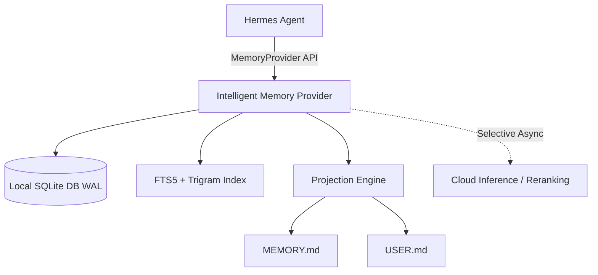

# ذاكرة هرمس الذكية (`hermes-intelligent-memory`)

[**English Documentation**](README.md) | [**المستندات باللغة الإنجليزية**](README.md)

---

## 📌 نبذة عن المشروع

مشروع **`hermes-intelligent-memory`** هو محرك ذاكرة ذكي محلي أولي (`Local-First`) ومصمم خصيصاً لدعم **اللغة العربية والمحتوى متعدد اللغات** كخيار رئيسي لوكيل **Hermes Agent**.

يوفر النظام استرجاعاً فوريًا وسريعاً بدون أي تأخير، مع تتبع كامل لأصل وسجل الذاكرة (`Append-Only Provenance`) والمزامنة الآمنة مع ملفات التراكم السريعة `MEMORY.md` و `USER.md`.

---

## 🔥 الميزات الأساسية

1. **🇸🇦 دعم عربي متقدم جداً:** يعتمد على التفكيك اللغوي، التداخل اللفظي (`Token Overlap`)، وتقنية الـ `Character Trigrams` للبحث والتعرف على المستندات والكلمات العربية والمركبة بدقة فائقة.
2. **⚡ استرجاع محلي بدون تأخير (Zero-Latency):** الاستعلام والبحث يتمان 100% محلياً عبر داتابيز SQLite في نمط الـ `WAL` وفهارس `FTS5` دون الاعتماد على السحابة في المسار السريع.
3. **📜 دورة حياة وحفظ أصل الذاكرة:** تتبع دقيق لجميع حالات الذاكرة (`active`, `superseded`, `archived`, `rejected`) لمنع التعارض أو فقدان التاريخ السلسلي.
4. **🔄 المزامنة التلقائية للملفات:** كتابة وتزكية الحقائق الهامة تلقائياً بداخل ملفات `MEMORY.md` و `USER.md` باستخدام عمليات كتابة ذرية وبسجلات احتياطية.
5. **🔒 عزل البروفايلات:** تخزين مستقل لكل بروفايل تحت المسار الخفي `$HERMES_HOME/intelligent_memory/memory.db`.
6. **🛠️ فحص التشخيص والأتمتة:** يحتوي على أداة `doctor.py` لفحص سلامة الفهارس وسكربت `installer.py` للتثبيت التلقائي.

---

## 🏗️ الهيكلية المعمارية



---

## 🔧 طريقة التثبيت والاستخدام

### 1. التثبيت المحلي:
```bash
# استنساخ المستودع
git clone https://github.com/hoysama/hermes-intelligent-memory.git
cd hermes-intelligent-memory

# التثبيت عبر uv أو pip
uv pip install -e .
```

أو تشغيل سكريبت التثبيت التلقائي:
```bash
python installer.py
```

### 2. التفعيل في إعدادات هرمس (`~/.hermes/config.yaml`):
```yaml
memory:
  provider: intelligent_memory
  intelligent_memory:
    enabled: true
    max_prefetched_facts: 10
```

### 3. الفحص والتحقق من سلامة الخدمة:
```bash
python doctor.py
```

---

## 🧪 تشغيل الاختبارات

لتشغيل حزمة الاختبارات الشاملة:
```bash
uv run pytest
```

---

## 📄 الترخيص (License)

تخضع هذه الحزمة لترخيص مشروع Hermes الأصلي. جميع الحقوق محفوظة لـ **HoySama** و **Hermes Ecosystem**.
