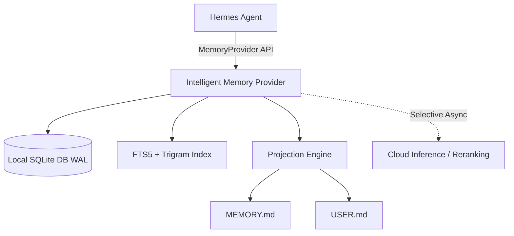

# ذاكرة هرمس الذكية (`hermes-intelligent-memory`)

[](README.ar.md)
[](pyproject.toml)
[](LICENSE)
[](plugin.yaml)

[**English Documentation**](README.md) | [**المستندات باللغة الإنجليزية**](README.md)

---

## 📌 نبذة عن المشروع

مشروع **`hermes-intelligent-memory`** هو محرك ذاكرة ذكي محلي أولياً (`Local-First`) ومصمم خصيصاً لدعم **اللغة العربية والمحتوى متعدد اللغات** كخيار رئيسي لوكيل **Hermes Agent**.

يوفر النظام استرجاعاً فوريًا وسريعاً بدون أي تأخير، مع تتبع كامل لأصل وسجل الذاكرة (`Append-Only Provenance`) والمزامنة الآمنة مع ملفات التراكم السريعة `MEMORY.md` و `USER.md`.

---

## 🔥 الميزات الأساسية

1. **🇸🇦 دعم عربي متقدم جداً:** يعتمد على التفكيك اللغوي، التداخل اللفظي (`Token Overlap`)، وتقنية الـ `Character Trigrams` للبحث والتعرف على المستندات والكلمات العربية والمركبة بدقة فائقة.
2. **⚡ استرجاع محلي بدون تأخير (Zero-Latency):** الاستعلام والبحث يتمان 100% محلياً عبر داتابيز SQLite في نمط الـ `WAL` وفهارس `FTS5` دون الاعتماد على السحابة في المسار السريع.
3. **📜 دورة حياة وحفظ أصل الذاكرة:** تتبع دقيق لجميع حالات الذاكرة (`active`, `superseded`, `archived`, `rejected`) لمنع التعارض أو فقدان التاريخ السلسلي.
4. **🔄 المزامنة التلقائية للملفات:** كتابة وتزكية الحقائق الهامة تلقائياً بداخل ملفات `MEMORY.md` و `USER.md` باستخدام عمليات كتابة ذرية وبسجلات احتياطية.
5. **🔒 عزل البروفايلات:** تخزين مستقل لكل بروفايل تحت المسار الخفي `$HERMES_HOME/intelligent_memory/memory.db`.
6. **🛠️ أدوات محرك هرمس:** دعم كامل لأدوات الذاكرة الذكية المستقلة في التلغرام والـ CLI.

---

## 🏗️ الهيكلية المعمارية



---

## 🔧 طريقة التثبيت والاستخدام

### 1. التثبيت السريع عبر أمر هرمس (One-Line Install):

```bash
hermes plugins install https://github.com/hoysama/hermes-intelligent-memory
```

### 2. التكوين الشامل والمفصل في إعدادات هرمس (`~/.hermes/config.yaml`):

أضف المربع المفصل والمشروح لإعدادات الذاكرة بداخل ملف الإعدادات الرئيسي (`~/.hermes/config.yaml`):

```yaml
memory:
  provider: intelligent_memory  # اسم مزود الذاكرة المفعل
  memory_enabled: true          # تفعيل نظام حفظ الذاكرة
  user_profile_enabled: true    # تفعيل حفظ بروفايل وحقائق المستخدم
  memory_char_limit: 35000      # الحد الأقصى لحروف الذاكرة المسترجعة
  user_char_limit: 35000        # الحد الأقصى لحروف بروفايل المستخدم
  write_approval: false         # الموافقة التلقائية على حفظ الذاكرة بدون أسئلة
  flush_min_turns: 6            # الحد الأدنى للجولات قبل مراجعة الذاكرة
  nudge_interval: 10            # فترات التنبيه التلقائي للتذكير بالذاكرة
  intelligent_memory:
    cloud_mode: 'off'           # الخيارات المتاحة: 'off' (محلي فقط), 'selective', 'session'
    max_recall_facts: 6         # الحد الأقصى لعدد الحقائق المسترجعة لكل جولة
    max_recall_chars: 1800      # الحد الأقصى لحجم حروف الحقائق المسترجعة
```

> [!IMPORTANT]
> **لماذا يعد ضبط `memory_char_limit` و `user_char_limit` إلزامياً في `config.yaml`؟**:
> بنية نواة Hermes Agent تفرض افتراضياً حداً ضيقاً جداً لملف الذاكرة `MEMORY.md` يبلغ **2,200 حرف فقط** (~800 توكن). عندما تكبر ذاكرتك وتتجاوز هذا الحد (مثلاً 50 حقيقة أو 16,000 حرف)، يقوم حارس الذاكرة الداخلي `MemoryStore` باعتراض أي محاولة حفظ جديدة ويخرج تحذير `(الذاكرة ممتلئة X/2,200)` مانعاً تسجيل أي حقائق إضافية. تحديد السقف بقيمة `35000` يمنح النظام مرونة كاملة ومساحة مريحة للنمو دون أي انقطاع أو تحذيرات زائفة.

---

## 🛠️ أدوات الذاكرة المتاحة في النظام

| اسم الأداة | الوصف |
| :--- | :--- |
| `intelligent_memory_remember` | حفظ حقيقة هيكلية دائمة بداخل الذاكرة الذكية |
| `intelligent_memory_recall` | البحث عن الحقائق النشطة المتعلقة باستعلام معين |
| `intelligent_memory_revise` | تعديل حقيقة سابقة مع حفظ تاريخ السجل |
| `intelligent_memory_forget` | أرشفة حقيقة دون حذف تاريخها السلسلي |
| `intelligent_memory_status` | تقرير عن حالة نظام الذاكرة وعدد الحقائق |
| `intelligent_memory_feedback` | تسجيل تقييم فائدة الحقائق المسترجعة لتطوير النتائج |

---

## 🖥️ أدوات سطر الأوامر المستقلة (Standalone CLI)

إدارة، بحث، تصدير، واستيراد ذكرياتك مباشرة من الطرفية دون الحاجة لتشغيل منصة هرمس:

```bash
# البحث الدلالي المباشر في الحقائق النشطة
python -m intelligent_memory.cli search "تقنيات المشروع"

# تصدير الذاكرة بصيغ قياسية عالمية (Markdown, JSON, JSON-LD)
python -m intelligent_memory.cli export --format markdown --output memories.md
python -m intelligent_memory.cli export --format json-ld --output memories.jsonld

# استيراد الحقائق من ملفات الملاحظات
python -m intelligent_memory.cli import memories.md
```

---

## 🩺 الفحص والتشخيص الذاتي مع الإصلاح الفوري (`doctor.py`)

تشغيل فحص شامل وإصلاح أي تلف أو نقص تلقائياً بضغطة زر واحدة:

```bash
# الفحص والإصلاح التلقائي لأي فهارس تالفة أو إسقاطات مفقودة
python doctor.py --fix

# عرض تقرير الفحص بصيغة JSON
python doctor.py --json
```

- **إصلاح الفهارس:** إعادة بناء فهارس البحث النصي SQLite FTS5 تلقائياً عند تلفها.
- **استعادة الإسقاطات:** إعادة توليد ملفات `MEMORY.md` و `USER.md` فوراً من قاعدة البيانات.
- **التحقق من سلامة الملفات:** فحص وتدقيق تواقيع التشفير واستعادة أي ملفات ناقصة.

---

## 🗄️ دورة حياة الذاكرة وضغط الحقب القديمة

- **الأرشفة الآلية للتقادم:** نقل الحقائق المتقادمة أو ذات التقييم السلبي تلقائياً من النشطة إلى المؤرشفة.
- **ضغط الحقب (Epoch Compression):** دمج وتلخيص الحقائق المؤرشفة في حقائق حقبة موجزة لمنع تضخم سياق المحادثة مع الاحتفاظ بكامل بيانات التتبع والـ Provenance.
- **تفريغ وتنظيف قاعدة البيانات (Vacuum):** استرجاع المساحات غير المستخدمة في القرص وتسريع فهارس B-tree.

---

## 🧪 تشغيل الاختبارات

لتشغيل حزمة الاختبارات الشاملة:
```bash
uv run pytest
```

---

## 📄 الترخيص (License)

تخضع هذه الحزمة لترخيص **MIT License**. تطوير وصيانة **HoySama** لمنظومة Hermes Agent.
