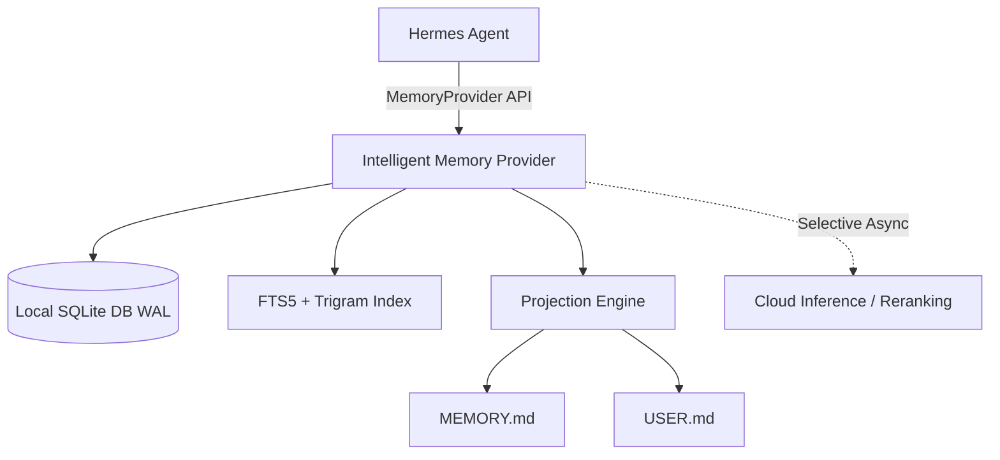

# Hermes Intelligent Memory (`hermes-intelligent-memory`)

[**اللغة العربية**](#-الميزات-الرئيسية-باللغة-العربية) | [**English**](#-overview)

---

## 🌐 Overview

`hermes-intelligent-memory` is a local-first, Arabic-aware intelligent `MemoryProvider` plugin for **Hermes Agent**. It provides high-performance, deterministic hybrid memory retrieval, append-only provenance tracking, and seamless projection sync with `MEMORY.md` and `USER.md`.

Designed to operate seamlessly without cloud dependencies on the hot path, it ensures zero-latency memory prefetching while supporting mixed Arabic/English text processing with advanced character trigram matching and FTS5 search.

---

## ✨ Key Features

- **🇸🇦 Arabic & Multilingual First-Class Support:** Advanced text normalization, token overlap matching, and character trigrams for Arabic and mixed Arabic/English substring recall.
- **⚡ Local-First & Deterministic (Zero-Latency Hot Path):** Retrieval operates 100% locally via SQLite (`WAL` mode) using FTS5 and trigram indexing. Cloud inference is never on the critical path.
- **📜 Append-Only Provenance & Immutable Lifecycle:** Full memory lifecycle management (`active`, `superseded`, `archived`, `rejected`) with audit trails and lineage tracking.
- **🔄 Projections Sync (`MEMORY.md` & `USER.md`):** High-importance global facts automatically materialize into markdown projections with atomic writes and safety backups.
- **🔒 Isolated Profile Scoping:** Profile-scoped storage under `$HERMES_HOME/intelligent_memory/memory.db`.
- **🛠️ Diagnostics & CLI Utilities:** Built-in health diagnostics (`doctor.py`) and automated installation scripts (`installer.py`).

---

## 🏗️ System Architecture



### Retrieval Pipeline

1. **Candidate Generation:** Exact Hash -> FTS5/BM25 -> Token Overlap -> Arabic Character Trigrams.
2. **Ranking Engine:** Lexical Relevance + Scope Match + Confidence + Importance + Freshness.
3. **Filtering:** Active status enforcement & safety policy validation.

---

## 🚀 Quick Start

### 1. Installation

Install into your active Hermes environment:

```bash
# Clone the repository
git clone https://github.com/hoysama/hermes-intelligent-memory.git
cd hermes-intelligent-memory

# Install as an editable package or via uv
uv pip install -e .
```

Alternatively, run the automated installer:

```bash
python installer.py
```

### 2. Configuration in Hermes

Add or set the memory provider in your Hermes `config.yaml` (`~/.hermes/config.yaml`):

```yaml
memory:
  provider: intelligent_memory
  intelligent_memory:
    enabled: true
    max_prefetched_facts: 10
```

### 3. Diagnostics & Verification

Run the built-in doctor utility to verify database integrity, indices, and provider integration:

```bash
python doctor.py
```

---

## 🧪 Running Tests

Run the comprehensive pytest suite:

```bash
uv run pytest
```

---

<br/>

---

# 🇸🇦 الميزات الرئيسية والتفاصيل (باللغة العربية)

## 📌 نبذة عن المشروع

مشروع **`hermes-intelligent-memory`** هو محرك ذاكرة ذكي محلي أولي (`Local-First`) ومصمم خصيصاً لدعم **اللغة العربية والمحتوى متعدد اللغات** كخيار رئيسي لوكيل **Hermes Agent**.

يوفر النظام استرجاعاً فوريًا وسريعاً بدون أي تأخير، مع تتبع كامل لأصل وسجل الذاكرة (`Append-Only Provenance`) والمزامنة الآمنة مع ملفات التراكم السريعة `MEMORY.md` و `USER.md`.

---

## 🔥 الميزات الأساسية

1. **🇸🇦 دعم عربي متقدم جداً:** يعتمد على التفكيك اللغوي، التداخل اللفظي (`Token Overlap`)، وتقنية الـ `Character Trigrams` للبحث والتعرف على المستندات والكلمات العربية والمركبة بدقة فائقة.
2. **⚡ استرجاع محلي بدون تأخير (Zero-Latency):** الاستعلام والبحث يتمان 100% محلياً عبر داتابيز SQLite في نمط الـ `WAL` وفهارس `FTS5` دون الاعتماد على السحابة في المسار السريع.
3. **📜 دورة حياة وحفظ أصل الذاكرة:** تتبع دقيق لجميع حالات الذاكرة (`active`, `superseded`, `archived`, `rejected`) لمنع التعارض أو فقدان التاريخ السلسلي.
4. **🔄 المزامنة التلقائية للملفات:** كتابة وتزكية الحقائق الهامة تلقائياً بداخل ملفات `MEMORY.md` و `USER.md` باستخدام عمليات كتابة ذرية وبسجلات احتياطية.
5. **🛠️ فحص التشخيص والأتمتة:** يحتوي على أداة `doctor.py` لفحص سلامة الفهارس وسكربت `installer.py` للتثبيت التلقائي.

---

## 🔧 طريقة التثبيت والاستخدام

### 1. التثبيت المحالي:
```bash
git clone https://github.com/hoysama/hermes-intelligent-memory.git
cd hermes-intelligent-memory
uv pip install -e .
```

### 2. التفعيل في إعدادات هرمس (`~/.hermes/config.yaml`):
```yaml
memory:
  provider: intelligent_memory
  intelligent_memory:
    enabled: true
```

### 3. الفحص والتحقق:
```bash
python doctor.py
```

---

## 📄 الترخيص (License)

تخضع هذه الحزمة لترخيص مشروع Hermes الأصلي. جميع الحقوق محفوظة لـ **HoySama** و **Hermes Ecosystem**.
