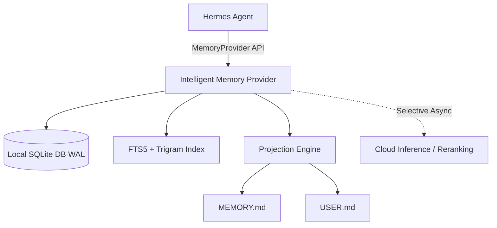

# Hermes Intelligent Memory (`hermes-intelligent-memory`)

[](README.ar.md)
[](pyproject.toml)
[](LICENSE)
[](plugin.yaml)

`hermes-intelligent-memory` is an official, local-first, Arabic/multilingual `MemoryProvider` plugin for **Hermes Agent**. It provides high-performance, deterministic hybrid memory retrieval, append-only provenance tracking, and seamless projection sync with `MEMORY.md` and `USER.md`.

Read this documentation in [🇸🇦 Arabic / بالعربية](README.ar.md).

---

## ✨ Key Features

- **🇸🇦 Arabic & Multilingual First-Class Support:** Advanced text normalization, token overlap matching, and character trigrams for Arabic and mixed Arabic/English substring recall.
- **⚡ Local-First & Deterministic (Zero-Latency Hot Path):** Retrieval operates 100% locally via SQLite (`WAL` mode) using FTS5 and trigram indexing. Cloud inference is never on the critical path.
- **📜 Append-Only Provenance & Immutable Lifecycle:** Full memory lifecycle management (`active`, `superseded`, `archived`, `rejected`) with audit trails and lineage tracking.
- **🔄 Projections Sync (`MEMORY.md` & `USER.md`):** High-importance global facts automatically materialize into markdown projections with atomic writes and safety backups.
- **🔒 Isolated Profile Scoping:** Profile-scoped storage under `$HERMES_HOME/intelligent_memory/memory.db`.
- **🛠️ Built-In Hermes Plugin CLI:** Diagnostics, migration utilities, and native plugin hooks.

---

## 🏗️ System Architecture



### Retrieval Pipeline

1. **Candidate Generation:** Exact Hash -> FTS5/BM25 -> Token Overlap -> Arabic Character Trigrams.
2. **Ranking Engine:** Lexical Relevance + Scope Match + Confidence + Importance + Freshness.
3. **Filtering:** Active status enforcement & safety policy validation.

---

## 🚀 Quick Start

### 1. One-Line Plugin Installation

Install directly into Hermes via the official CLI:

```bash
hermes plugins install https://github.com/hoysama/hermes-intelligent-memory
```

### 2. Complete Configuration in Hermes (`~/.hermes/config.yaml`)

Add the annotated `memory` block to your Hermes configuration (`~/.hermes/config.yaml`):

```yaml
memory:
  provider: intelligent_memory  # Active memory provider
  memory_enabled: true          # Enable durable conversation memory
  user_profile_enabled: true    # Enable user profile facts tracking
  memory_char_limit: 35000      # Max total characters for recalled memory context
  user_char_limit: 35000        # Max total characters for user profile context
  write_approval: false         # Auto-approve memory writes without manual prompts
  flush_min_turns: 6            # Minimum turns before memory flush evaluation
  nudge_interval: 10            # Memory reminder nudge frequency
  intelligent_memory:
    cloud_mode: 'off'           # Options: 'off' (local-only), 'selective', 'session'
    max_recall_facts: 6         # Maximum facts to recall per turn
    max_recall_chars: 1800      # Maximum character length for recalled facts
```

---

## 🛠️ Available Provider Tools

| Tool Name | Description |
| :--- | :--- |
| `intelligent_memory_remember` | Store one durable structured fact in intelligent memory |
| `intelligent_memory_recall` | Search active intelligent-memory facts relevant to a query |
| `intelligent_memory_revise` | Replace one durable fact while preserving its lineage |
| `intelligent_memory_forget` | Archive one fact without deleting its history |
| `intelligent_memory_status` | Report provider status and fact counts |
| `intelligent_memory_feedback` | Record usefulness feedback to refine recall scoring |

---

## 🖥️ Standalone CLI & Management Tools

Manage, search, export, and import your memories directly from the terminal without launching Hermes:

```bash
# Search active facts
python -m intelligent_memory.cli search "query terms"

# Export memory to standard formats (markdown, json, json-ld)
python -m intelligent_memory.cli export --format markdown --output memories.md
python -m intelligent_memory.cli export --format json-ld --output memories.jsonld

# Import memory facts from seed files
python -m intelligent_memory.cli import memories.md
```

---

## 🩺 Self-Healing Diagnostics (`doctor.py`)

Run automated diagnostics and self-healing repair routines for your memory store:

```bash
# Diagnose and auto-repair broken indices and missing projections
python doctor.py --fix

# Output diagnostic results as JSON
python doctor.py --json
```

- **Index Healing:** Automatically reconstructs corrupted or out-of-sync SQLite FTS5 search tables (`facts_fts`).
- **Projection Recovery:** Regenerates missing or corrupted `MEMORY.md` and `USER.md` markdown views directly from the canonical SQLite database.
- **Asset Integrity:** Verifies all plugin file checksums and restores missing files.

---

## 🗄️ Memory Lifecycle & Epoch Compression

- **Staleness Auto-Archiving:** Automatically transitions inactive or negatively rated facts from `active` to `archived`.
- **Epoch Compression:** Consolidates historical archived facts into structured `epoch_summary` facts to prevent context bloat while retaining complete provenance history.
- **Vacuum & Page Defragmentation:** Reclaims disk space and optimizes SQLite B-tree pages and FTS token inverted indices.

---

## 🧪 Running Tests

Run the comprehensive test suite:

```bash
uv run pytest
```

---

## 📄 License

Distributed under the **MIT License**. Created & maintained by **HoySama** for the Hermes Agent Ecosystem.
