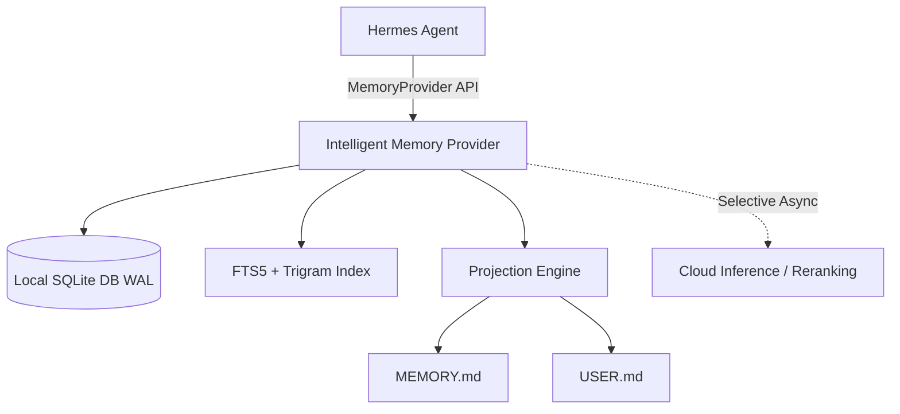

# Hermes Intelligent Memory (`hermes-intelligent-memory`)

[](README.ar.md)
[](pyproject.toml)
[](LICENSE)
[](plugin.yaml)

`hermes-intelligent-memory` is an official, local-first, Arabic/multilingual `MemoryProvider` plugin for **Hermes Agent**. It provides high-performance, deterministic hybrid memory retrieval, append-only provenance tracking, and seamless projection sync with `MEMORY.md` and `USER.md`.

Read this documentation in [🇸🇦 Arabic / بالعربية](README.ar.md).

---

## ✨ Key Features

- **🇸🇦 Arabic & Multilingual First-Class Support:** Advanced text normalization, token overlap matching, and character trigrams for Arabic and mixed Arabic/English substring recall.
- **⚡ Local-First & Deterministic (Zero-Latency Hot Path):** Retrieval operates 100% locally via SQLite (`WAL` mode) using FTS5 and trigram indexing. Cloud inference is never on the critical path.
- **📜 Append-Only Provenance & Immutable Lifecycle:** Full memory lifecycle management (`active`, `superseded`, `archived`, `rejected`) with audit trails and lineage tracking.
- **🔄 Projections Sync (`MEMORY.md` & `USER.md`):** High-importance global facts automatically materialize into markdown projections with atomic writes and safety backups.
- **🔒 Isolated Profile Scoping:** Profile-scoped storage under `$HERMES_HOME/intelligent_memory/memory.db`.
- **🛠️ Built-In Hermes Plugin CLI:** Diagnostics, migration utilities, and native plugin hooks.

---

## 🏗️ System Architecture



### Retrieval Pipeline

1. **Candidate Generation:** Exact Hash -> FTS5/BM25 -> Token Overlap -> Arabic Character Trigrams.
2. **Ranking Engine:** Lexical Relevance + Scope Match + Confidence + Importance + Freshness.
3. **Filtering:** Active status enforcement & safety policy validation.

---

## 🚀 Quick Start

### 1. One-Line Plugin Installation

Install directly into Hermes via the official CLI:

```bash
hermes plugin install https://github.com/hoysama/hermes-intelligent-memory
```

### 2. Manual / Developer Installation

Clone the repository and install as an editable package:

```bash
git clone https://github.com/hoysama/hermes-intelligent-memory.git
cd hermes-intelligent-memory
uv pip install -e .
```

### 3. Activation in Hermes Configuration (`~/.hermes/config.yaml`)

Set `intelligent_memory` as your active memory provider in your Hermes `config.yaml`:

```yaml
memory:
  provider: intelligent_memory
  intelligent_memory:
    cloud_mode: selective
    max_recall_facts: 6
    max_recall_chars: 1800
```

---

## 🛠️ Available Provider Tools

| Tool Name | Description |
| :--- | :--- |
| `intelligent_memory_remember` | Store one durable structured fact in intelligent memory |
| `intelligent_memory_recall` | Search active intelligent-memory facts relevant to a query |
| `intelligent_memory_revise` | Replace one durable fact while preserving its lineage |
| `intelligent_memory_forget` | Archive one fact without deleting its history |
| `intelligent_memory_status` | Report provider status and fact counts |
| `intelligent_memory_feedback` | Record usefulness feedback to refine recall scoring |

---

## 🧪 Running Tests

Run the comprehensive test suite:

```bash
uv run pytest
```

---

## 📄 License

Distributed under the **MIT License**. Created & maintained by **HoySama** for the Hermes Agent Ecosystem.
