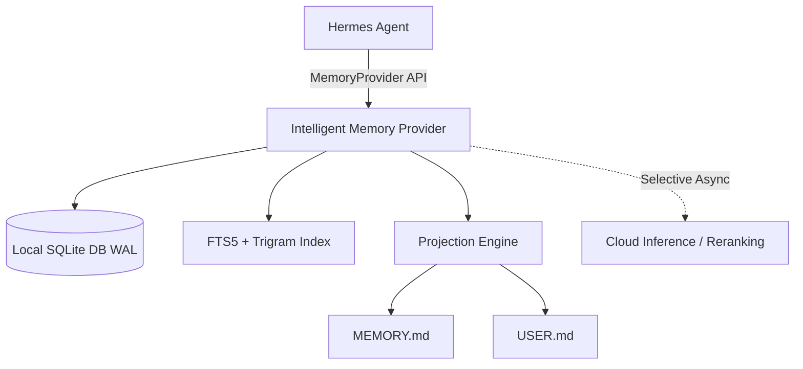

# Hermes Intelligent Memory (`hermes-intelligent-memory`)

[](README.ar.md)
[](pyproject.toml)
[](LICENSE)

`hermes-intelligent-memory` is a local-first, Arabic-aware intelligent `MemoryProvider` plugin for **Hermes Agent**. It provides high-performance, deterministic hybrid memory retrieval, append-only provenance tracking, and seamless projection sync with `MEMORY.md` and `USER.md`.

Read this documentation in [🇸🇦 Arabic / بالعربية](README.ar.md).

---

## ✨ Key Features

- **🇸🇦 Arabic & Multilingual First-Class Support:** Advanced text normalization, token overlap matching, and character trigrams for Arabic and mixed Arabic/English substring recall.
- **⚡ Local-First & Deterministic (Zero-Latency Hot Path):** Retrieval operates 100% locally via SQLite (`WAL` mode) using FTS5 and trigram indexing. Cloud inference is never on the critical path.
- **📜 Append-Only Provenance & Immutable Lifecycle:** Full memory lifecycle management (`active`, `superseded`, `archived`, `rejected`) with audit trails and lineage tracking.
- **🔄 Projections Sync (`MEMORY.md` & `USER.md`):** High-importance global facts automatically materialize into markdown projections with atomic writes and safety backups.
- **🔒 Isolated Profile Scoping:** Profile-scoped storage under `$HERMES_HOME/intelligent_memory/memory.db`.
- **🛠️ Diagnostics & CLI Utilities:** Built-in health diagnostics (`doctor.py`) and automated installation scripts (`installer.py`).

---

## 🏗️ System Architecture



### Retrieval Pipeline

1. **Candidate Generation:** Exact Hash -> FTS5/BM25 -> Token Overlap -> Arabic Character Trigrams.
2. **Ranking Engine:** Lexical Relevance + Scope Match + Confidence + Importance + Freshness.
3. **Filtering:** Active status enforcement & safety policy validation.

---

## 🚀 Quick Start

### 1. Installation

Install into your active Hermes environment:

```bash
# Clone the repository
git clone https://github.com/hoysama/hermes-intelligent-memory.git
cd hermes-intelligent-memory

# Install as an editable package or via uv
uv pip install -e .
```

Alternatively, run the automated installer:

```bash
python installer.py
```

### 2. Configuration in Hermes

Add or set the memory provider in your Hermes `config.yaml` (`~/.hermes/config.yaml`):

```yaml
memory:
  provider: intelligent_memory
  intelligent_memory:
    enabled: true
    max_prefetched_facts: 10
```

### 3. Diagnostics & Verification

Run the built-in doctor utility to verify database integrity, indices, and provider integration:

```bash
python doctor.py
```

---

## 🧪 Running Tests

Run the comprehensive pytest suite:

```bash
uv run pytest
```

---

## 📄 License

This package is licensed under the Hermes Ecosystem License. All rights reserved by **HoySama**.
